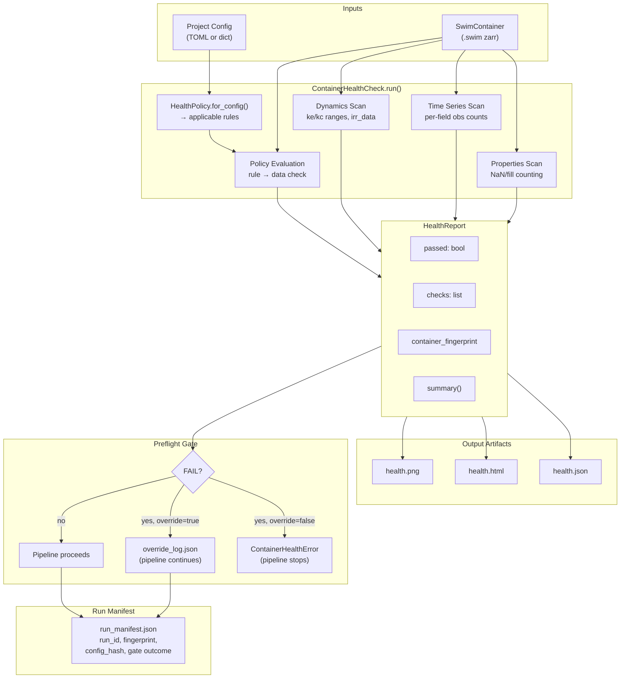

# Container QAQC: Health Checking and Preflight Gates

Headless calibration runs are expensive. A single corrupted property array or missing ETf dataset can waste hours of PEST++ compute before the error surfaces as an inscrutable NaN cascade. The container health-check system catches these problems up front with automated, config-aware validation that runs before any expensive work begins.

The system has five layers: a **declarative policy** that maps config choices to data requirements, a **check engine** that scans properties/time-series/dynamics arrays, a **report** that packages results for humans and machines, a **preflight gate** that blocks batch calibration on failures, and a **run manifest** that records the exact data state for provenance.

---

## Health Policy

`HealthPolicy` is a declarative rule system that defines what data the container must have, given the project configuration. Rules live in two groups:

### Base Rules (always checked)

These apply to every container regardless of configuration:

| Path | Check | Severity | Reason |
|------|-------|----------|--------|
| `properties/soils/awc` | `not_all_nan` | FAIL | AWC is required for water balance |
| `properties/soils/clay` | `not_all_nan` | WARN | Clay fraction used for soil evaporation |
| `properties/land_cover/modis_lc` | `not_all_fill` (fill=-1) | FAIL | Land cover required for rooting depth |

### Conditional Rules (config-driven)

These activate only when the corresponding config key matches:

| Config Key | Config Value | Path | Check | Severity |
|------------|-------------|------|-------|----------|
| `mask_mode` | `irrigation` | `properties/irrigation/irr` | `not_all_nan` | FAIL |
| `mask_mode` | `irrigation` | `properties/irrigation/irr_yearly` | `not_all_empty` | FAIL |

### Dynamic Rules

Some rules are assembled at runtime from config values:

- **`etf_target_model`** — If set (e.g. `"ssebop"`), requires the ETf array at `remote_sensing/etf/landsat/{model}/{mask}` where `mask` is `irr` or `inv_irr` based on `mask_mode`.

- **`etf_ensemble_members`** — For each member in the list, requires its ETf array at the corresponding path.

- **`met_source`** — If set (e.g. `"gridmet"`), requires `meteorology/{met_source}/eto`.

- **`snow_source`** — If set (e.g. `"snodas"`), requires `snow/{snow_source}/swe`.

### Assembling the Rule Set

`HealthPolicy.for_config(config_dict)` takes a plain dict and returns the full list of `PolicyRule` objects that apply. It starts with the three base rules, appends any conditional rules whose `config_key`/`config_value` match, then builds dynamic rules from `etf_target_model`, `etf_ensemble_members`, `met_source`, and `snow_source`.

```python
from swimrs.container.health import HealthPolicy

rules = HealthPolicy.for_config({
    "mask_mode": "irrigation",
    "etf_target_model": "ssebop",
    "met_source": "gridmet",
    "snow_source": "snodas",
})
# Returns ~7 rules: 3 base + 2 irrigation + 1 ETf + 1 met + 1 snow (no ensemble)
```

### Check Types

Each rule specifies one of six check types:

| Check | Meaning |
|-------|---------|
| `not_all_nan` | Array exists and at least one value is not NaN |
| `not_all_fill` | Array exists and at least one value differs from the fill value |
| `exists` | Array exists in the zarr store (contents not inspected) |
| `not_all_empty` | String/JSON array has at least one non-empty entry |
| `field_coverage_union` | Every field has >0 obs in at least one of `{path}/irr` or `{path}/inv_irr` |
| `field_coverage` | Every field in the array has at least one valid observation |

---

## Health Check Engine

`ContainerHealthCheck` is the workhorse. It takes a zarr root, a list of field UIDs, and an optional config dict. Calling `run()` executes four scan phases and returns a `HealthReport`.

```python
from swimrs.container.health import ContainerHealthCheck

checker = ContainerHealthCheck(zarr_root, field_uids, config=config_dict)
report = checker.run()
```

### Phase 1: Properties Scan

Iterates over known 1D property paths (`properties/soils/awc`, `properties/soils/clay`, `properties/soils/sand`, `properties/soils/ksat`, `properties/land_cover/modis_lc`, `properties/irrigation/irr`, `properties/location/lat`, `properties/location/lon`, `properties/location/elevation`) and counts valid vs NaN/fill values:

- **FAIL** if all values are NaN or fill
- **WARN** if >10% of values are NaN or fill
- **PASS** otherwise

Each check records `total`, `valid`, `fill_or_nan`, `min`, and `max` in its detail dict.

### Phase 2: Time Series Scan

Recursively walks all 2D arrays under `remote_sensing/`, `meteorology/`, and `snow/`. For each array (shape `[n_time, n_fields]`), computes per-field observation counts:

- **FAIL** if the entire array is NaN
- **WARN** if any fields have zero valid observations
- **PASS** otherwise, reporting the median observation count

**Paired irr/inv_irr handling:** When a group contains both `irr` and `inv_irr` 2D array children, the time-series scan skips them. Field-level coverage for these paired arrays is handled by policy rules (`field_coverage_union`) which check that each field has observations in at least one of the pair. This avoids misleading WARNs for fields that legitimately only have data in one mask.

Detail includes the full distribution: `obs_per_field_min`, `obs_per_field_p25`, `obs_per_field_median`, `obs_per_field_p75`, `obs_per_field_max`, and `fields_with_zero_obs`.

### Phase 3: Dynamics Scan

Checks derived dynamics arrays:

- **`derived/dynamics/ke_max`** and **`derived/dynamics/kc_max`** — reports NaN count and valid value range
- **`derived/dynamics/irr_data`** — parses each field's JSON string and counts how many fields have at least one irrigated year. Warns if zero fields are irrigated.

### Phase 4: Policy Evaluation

Calls `HealthPolicy.for_config()` with the provided config and evaluates each rule against the actual zarr arrays. A failing rule produces a check with the rule's severity (`FAIL` or `WARN`).

---

## Health Report

`HealthReport` is the output of a health check run. It is a dataclass with these fields:

| Field | Type | Description |
|-------|------|-------------|
| `container_path` | `str` | Path to the container |
| `n_fields` | `int` | Number of fields |
| `n_days` | `int` | Number of days in time axis |
| `date_range` | `tuple[str, str]` | Start and end dates |
| `checks` | `list[CheckResult]` | All individual check results |
| `policy_version` | `str` | Health policy version (currently `"1.0"`) |
| `container_fingerprint` | `str` | 16-char hex hash of container contents |
| `config_hash` | `str \| None` | SHA-256 hash of config dict |

### Key Properties

- **`report.passed`** — `True` if no checks have severity `FAIL`
- **`report.failures`** — list of `CheckResult` with severity `FAIL`
- **`report.warnings`** — list of `CheckResult` with severity `WARN`

### Console Summary

`report.summary()` returns a compact multi-line string:

```
Container Health: PASS
  Path: /nas/swim/examples/tongue/data/tongue.swim
  Fields: 2084  Days: 2922  Range: 2016-01-01 to 2023-12-31
  Checks: 14 pass, 2 warn, 0 fail
  Fingerprint: a1b2c3d4e5f67890
  Policy: v1.0
  WARNINGS:
    [properties] properties/soils/clay: 42/2084 (2.0%) values are NaN/fill
    [time_series] remote_sensing/ndvi/landsat/irr: 3/2084 fields have zero valid obs
```

### Machine-Readable Output

- **`report.to_json()`** — returns a dict with all fields, a `summary` sub-dict (`n_pass`, `n_warn`, `n_fail`), and a UTC `timestamp`.
- **`report.write_json(path)`** — serializes `to_json()` to a file.

---

## Output Artifacts

When `output_dir` is provided to the report API, three artifacts are written:

### `health.json`

Full machine-readable report from `report.to_json()`. Contains every check result with section, path, severity, message, and detail dict. Useful for CI integration or programmatic analysis.

### `health.html`

Self-contained HTML page rendered via jinja2 (`render_html_report()`). Color-coded by severity: red rows for FAIL, yellow for WARN, green for PASS. Checks are sorted with failures first. Includes an overview table with container metadata and fingerprint.

### `health.png`

Three-panel matplotlib figure (`render_summary_png()`):

1. **Properties Coverage** — horizontal bar chart showing % valid values per property, colored by severity
2. **Time Series Coverage** — horizontal bar chart showing median observations per field for each time series array
3. **Policy Checks** — color-coded pass/warn/fail bar for each policy rule

### Container Fingerprint

`fingerprint_container(zarr_root, field_uids)` computes a sample-based SHA-256 hash:

- Hashes all field UIDs
- Recursively walks all zarr arrays, hashing each array's name, shape, and dtype
- For 1D arrays: hashes full content
- For 2D arrays: hashes first 10 and last 10 rows

Returns a 16-character hex string. This fingerprint uniquely identifies the data state without hashing the entire multi-GB container.

---

## Using the Report API

### From SwimContainer

```python
from swimrs.container.container import SwimContainer

container = SwimContainer.open("project.swim", mode="r")
report = container.report(
    config={"mask_mode": "irrigation", "etf_target_model": "ssebop"},
    output_dir="/tmp/health_output",
    raise_on_fail=True,  # raises ContainerHealthError on FAIL
)
```

`SwimContainer.report()` accepts either a plain dict or a `ProjectConfig` object. If a `ProjectConfig` is passed, it extracts the relevant keys (`mask_mode`, `etf_target_model`, `etf_ensemble_members`, `met_source`, `snow_source`) into a dict automatically.

### From Inventory

```python
container.inventory.report(
    config=config_dict,
    raise_on_fail=False,
    output_dir="/tmp/health_output",
)
```

Both `SwimContainer.report()` and `Inventory.report()` print the console summary, write artifacts to `output_dir` (if provided), and optionally raise `ContainerHealthError`.

**Config type safety:** `Inventory.report()` requires `config` to be a `dict` or `None`. Passing a non-dict object (e.g. an argparse Namespace or ProjectConfig) raises `TypeError` with a message directing callers to use `SwimContainer.report()` instead, which handles `ProjectConfig` → dict conversion automatically.

### ContainerHealthError

```python
from swimrs.container.health import ContainerHealthError

try:
    container.report(config=cfg, raise_on_fail=True)
except ContainerHealthError as e:
    print(e)           # "Container health check failed: 2 FAIL(s). ..."
    print(e.report)    # the full HealthReport object
```

The exception carries the full `HealthReport` so callers can inspect individual failures.

---

## Preflight Gate

The `preflight_gate()` function in `batch_calibrate.py` is the integration point between the health check system and the calibration pipeline. It runs before any batch processing begins.

```python
from swim_mtdnrc.calibration.batch_calibrate import preflight_gate

report = preflight_gate(
    container_path="/nas/swim/examples/tongue/data/tongue.swim",
    toml_path="/nas/swim/examples/tongue/tongue.toml",
    output_root="/nas/swim/examples/tongue/pestrun",
    override=False,
)
```

### What It Does

1. Reads the project config from the TOML file via `ProjectConfig.read_config()`
2. Opens the container in read-only mode
3. Calls `container.report(config=config, raise_on_fail=(not override), output_dir=output_root)`
4. Writes `health.json` and `health.html` to the output root

### Default Behavior (override=False)

If any check has severity FAIL, `ContainerHealthError` is raised and the pipeline stops. The `calibrate_all()` function catches this and prints `PREFLIGHT GATE BLOCKED`.

### Override Mode (--override flag)

When `override=True`, failures are logged but do not block:

- A warning is printed: `WARNING: N FAIL(s) overridden by --override flag`
- An `override_log.json` file is written with the timestamp, failure details, and `"user_override": true`

### Where It Sits in the Pipeline

```
calibrate_all()
  ├── preflight_gate()          ← blocks here on FAIL
  ├── partition_fields_by_gfid()
  ├── _create_run_manifest()
  └── for each batch:
      ├── build_batch()
      ├── run_batch()            (PEST++ IES)
      ├── ingest_batch()
      └── cleanup
```

---

## Run Manifest

`_create_run_manifest()` writes `run_manifest.json` at the start of `calibrate_all()`, immediately after the preflight gate passes. It captures the full state needed to reproduce or audit a calibration run.

### Fields

| Field | Description |
|-------|-------------|
| `run_id` | Unique ID: `tongue_YYYYMMDD_HHMMSS` |
| `timestamp` | ISO-8601 timestamp |
| `container_path` | Absolute path to the .swim container |
| `container_fingerprint` | 16-char hex hash from the health report |
| `config_path` | Absolute path to the TOML config |
| `config_hash` | `sha256:...` hash of the TOML file bytes |
| `policy_version` | Health policy version string |
| `gate_outcome` | `"PASS"`, `"OVERRIDE"`, or `"FAIL"` |
| `gate_failures` | List of failure check dicts |
| `gate_warnings` | List of warning messages |
| `override` | Whether `--override` was used |
| `parameters.noptmax` | PEST++ max iterations |
| `parameters.reals` | Ensemble realizations |
| `parameters.workers` | PEST++ workers per batch |
| `parameters.batch_size` | Target fields per batch |
| `parameters.n_batches` | Number of batches to process |
| `parameters.n_fields` | Total fields across all batches |

### Tracing a Run

Given a `run_manifest.json`, you can trace a calibration back to the exact data state:

1. **Container fingerprint** identifies the exact array contents at run time
2. **Config hash** identifies the exact TOML configuration used
3. **Gate outcome** tells you whether health checks passed clean or were overridden
4. **Parameters** record the PEST++ settings used

---

## QAQC Flow Diagram

Shows how config and container data flow through the health check system to produce artifacts and gate the calibration pipeline.



---

## Run-Container QAQC Policy

Disposable hindcast/forecast containers built with `swim project` follow a different health-policy contract from calibration containers.

### Why this differs

- Calibration containers commonly ingest observed SWE (`snow/{source}/swe`) for calibration workflows.
- Run containers use the process model's internal snow dynamics with calibrated snow parameters; observed SWE arrays are intentionally omitted.

### Recommended run-container health config

For `swim project`, use a reduced health config:

```python
health_config = {
    "mask_mode": config.mask_mode,
    "met_source": met_source,
}
```

Do **not** include `snow_source` for run-container health checks, or the policy will require `snow/{snow_source}/swe` and produce a false FAIL.

### Practical gating

- Keep `raise_on_fail=True` so real forcing/coverage issues still block run-container creation.
- Restrict the evaluated keys to those relevant for disposable runs (`mask_mode`, `met_source`, and optional ETf keys if needed).
